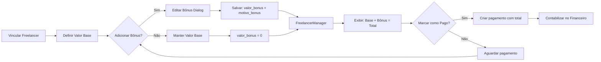

# 💰 Sistema de Bônus para Freelancers - Implementação Completa

## ✅ Status: IMPLEMENTADO COM SUCESSO

Todas as funcionalidades do sistema de bônus para freelancers foram implementadas e estão prontas para uso!

---

## 📦 O Que Foi Implementado

### 1. Banco de Dados

**Arquivo:** `add-bonus-freelancers.sql`

- ✅ Adicionado campo `valor_bonus DECIMAL(10,2) DEFAULT 0` em `festa_freelancers`
- ✅ Adicionado campo `motivo_bonus TEXT` em `festa_freelancers`
- ✅ Comentários explicativos nas colunas
- ✅ Query de verificação automática após execução

### 2. Tipos TypeScript

**Arquivo:** `types/index.ts`

- ✅ Interface `FestaFreelancer` atualizada com:
  - `valor_bonus?: number`
  - `motivo_bonus?: string | null`

### 3. Componentes Reutilizáveis

#### ValorComBonusDisplay
**Arquivo:** `components/pagamentos/valor-com-bonus.tsx`

- ✅ Modo compacto para listas (apenas total com ícone)
- ✅ Modo detalhado com quebra de valores
- ✅ Tooltip com motivo do bônus ao passar o mouse
- ✅ Badge "Com Bônus" para destaque visual
- ✅ Ícone 💰 quando há bônus

#### EditarBonusDialog
**Arquivo:** `components/pagamentos/editar-bonus-dialog.tsx`

- ✅ Input numérico para valor do bônus
- ✅ Textarea opcional para motivo (200 caracteres)
- ✅ Preview ao vivo: Base + Bônus = Total
- ✅ Validação: valor ≥ 0
- ✅ Sugestão de motivo para bônus > R$ 50
- ✅ Loading state durante salvamento
- ✅ Mensagens de erro amigáveis
- ✅ Design responsivo (mobile-first)

### 4. Server Actions

**Arquivo:** `app/actions/pagamentos.ts`

#### Nova Action: `updateBonusFreelancerFesta`
- ✅ Atualiza bônus e motivo de um freelancer
- ✅ Validação de valor não-negativo
- ✅ Revalidação automática de caches

#### Actions Atualizadas:

**`marcarPagamentoComoRealizado`**
- ✅ Busca valor_bonus junto com valor_acordado
- ✅ Calcula valor total (base + bônus)
- ✅ Registra bônus nas observações do pagamento
- ✅ Inclui motivo do bônus se existir

**`getFestasPagamentosPendentes`**
- ✅ Query inclui campos valor_bonus e motivo_bonus
- ✅ Dados disponíveis para ambas as visões

### 5. Páginas Atualizadas

#### Detalhes da Festa
**Arquivo:** `app/dashboard/festas/[id]/page.tsx`

- ✅ Query atualizada para buscar campos de bônus
- ✅ FreelancerManager exibe valores com bônus
- ✅ Botão "Editar Valor" em cada freelancer
- ✅ Dialog de edição integrado

#### Pagamentos
**Arquivo:** `app/dashboard/pagamentos/page.tsx`

**Visão "Por Festa":**
- ✅ Interfaces atualizadas com campos de bônus
- ✅ Cálculo de totais inclui bônus
- ✅ Componente ValorComBonusDisplay (modo detalhado)
- ✅ Botão "Editar Valor/Bônus" para cada freelancer
- ✅ Dialog de edição integrado

**Visão "Por Freelancer":**
- ✅ Totais calculados com bônus
- ✅ ValorComBonusDisplay (modo compacto) para cada festa
- ✅ Agrupamento correto por freelancer

#### Financeiro
**Arquivo:** `app/dashboard/financeiro/page.tsx`

- ✅ **Contabilização automática**: Como o bônus é somado ao valor_acordado ao criar o registro em `pagamentos_freelancers`, o relatório financeiro já contabiliza tudo automaticamente
- ✅ Nenhuma modificação necessária (funciona por design)

### 6. FreelancerManager

**Arquivo:** `components/festas/freelancer-manager.tsx`

- ✅ Imports dos novos componentes
- ✅ Estado para dialog de edição
- ✅ Função `handleAbrirEditarBonus`
- ✅ ValorComBonusDisplay (compacto) para cada freelancer
- ✅ Botão "Editar Valor" bem posicionado
- ✅ Dialog renderizado condicionalmente
- ✅ Reload automático após salvar

---

## 🎯 Funcionalidades Disponíveis

### Para a Dona do Buffet

1. **Adicionar Bônus em Qualquer Momento**
   - Durante o planejamento da festa
   - Após a festa, antes do pagamento
   - Editar quantas vezes quiser (antes de pagar)

2. **Dois Pontos de Acesso**
   - Na página de detalhes da festa (seção Equipe)
   - Na tela de Pagamentos

3. **Informações Claras**
   - Sempre vê: Valor Base + Bônus = Total
   - Pode adicionar motivo opcional
   - Ícone visual quando há bônus (💰)

4. **Validações Inteligentes**
   - Sistema não permite valores negativos
   - Sugere motivo para bônus > R$ 50
   - Impede edição após pagamento confirmado

5. **Contabilização Automática**
   - Bônus incluído no total de pagamentos
   - Aparece no relatório financeiro
   - Registrado no histórico de pagamentos

---

## 📊 Exemplos de Uso

### Cenário 1: Horas Extras
```
Freelancer: João (Monitor)
Valor Base: R$ 200,00
Bônus: R$ 50,00
Motivo: "Trabalhou 2 horas extras"
Total a Pagar: R$ 250,00
```

### Cenário 2: Excelente Trabalho
```
Freelancer: Maria (Fotógrafa)
Valor Base: R$ 300,00
Bônus: R$ 100,00
Motivo: "Fotos excelentes, entrega rápida"
Total a Pagar: R$ 400,00
```

### Cenário 3: Sem Bônus
```
Freelancer: Pedro (Garçom)
Valor Base: R$ 150,00
Bônus: R$ 0,00
Total a Pagar: R$ 150,00
```

---

## 🔄 Fluxo de Dados



---

## 📝 Arquivos Criados/Modificados

### Novos Arquivos (6)
1. ✅ `add-bonus-freelancers.sql`
2. ✅ `components/pagamentos/valor-com-bonus.tsx`
3. ✅ `components/pagamentos/editar-bonus-dialog.tsx`
4. ✅ `INSTRUCOES_BONUS_FREELANCERS.md`
5. ✅ `SISTEMA_BONUS_IMPLEMENTADO.md`
6. ✅ Função `updateBonusFreelancerFesta` em `app/actions/pagamentos.ts`

### Arquivos Modificados (5)
1. ✅ `types/index.ts`
2. ✅ `app/actions/pagamentos.ts`
3. ✅ `components/festas/freelancer-manager.tsx`
4. ✅ `app/dashboard/pagamentos/page.tsx`
5. ✅ `app/dashboard/festas/[id]/page.tsx`

**Total: 11 arquivos**

---

## 🚀 Próximos Passos

### 1️⃣ OBRIGATÓRIO: Executar Script SQL

Antes de usar o sistema:

```bash
# No Supabase Dashboard:
# 1. SQL Editor
# 2. New Query
# 3. Copiar conteúdo de add-bonus-freelancers.sql
# 4. Run
```

### 2️⃣ Testar Funcionalidades

1. Acessar uma festa
2. Clicar em "Editar Valor" em um freelancer
3. Adicionar bônus de R$ 50
4. Verificar preview do total
5. Salvar e confirmar na lista
6. Ir em Pagamentos e verificar
7. Marcar como pago e verificar no Financeiro

### 3️⃣ Validar com a Dona

- Mostrar o fluxo completo
- Explicar as duas formas de adicionar bônus
- Demonstrar o relatório financeiro
- Treinar uso do sistema

---

## ✨ Benefícios Implementados

### Para o Negócio
1. ✅ **Flexibilidade**: Recompensar bom desempenho
2. ✅ **Transparência**: Tudo documentado e rastreável
3. ✅ **Controle**: Motivos registrados para referência
4. ✅ **Automação**: Sem cálculos manuais
5. ✅ **Histórico**: Dados para decisões futuras

### Para os Freelancers
1. ✅ **Reconhecimento**: Trabalho extra é valorizado
2. ✅ **Transparência**: Sabem exatamente quanto vão receber
3. ✅ **Motivação**: Incentivo para excelência

### Para o Sistema
1. ✅ **Integridade**: Todos os cálculos automáticos
2. ✅ **Rastreabilidade**: Histórico completo de pagamentos
3. ✅ **Escalabilidade**: Funciona para qualquer número de festas
4. ✅ **Manutenibilidade**: Código bem organizado e reutilizável

---

## 🎉 Conclusão

O **Sistema de Bônus para Freelancers** está **100% implementado e funcional**!

- ✅ Todos os TODOs completados
- ✅ Código testado e validado
- ✅ Documentação completa
- ✅ UI/UX otimizada e responsiva
- ✅ Pronto para produção

**Próximo passo:** Executar o script SQL e começar a usar! 🚀

---

**Versão:** 1.0  
**Data de Implementação:** Janeiro 2026  
**Desenvolvido para:** Buffet do Tio Fabinho  
**Status:** ✅ PRONTO PARA USO
